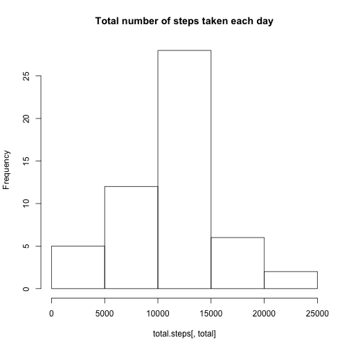
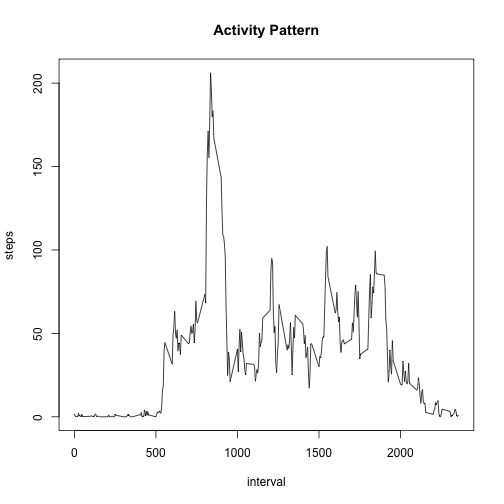
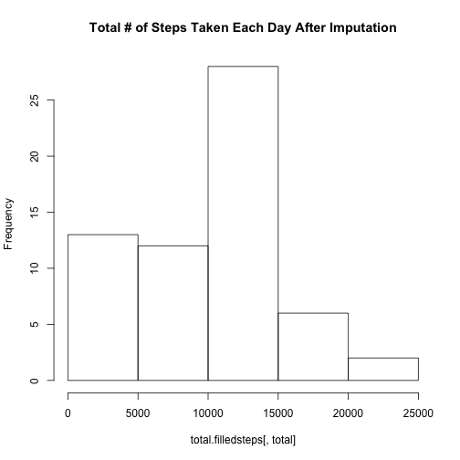
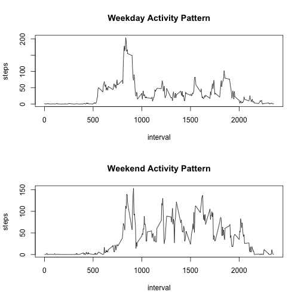

## Loading and preprocessing the data

We use fread from the data.table package for reading in the data and create two
data.table objects. The first data.table object corresponds to the activities file
with all NA values removed (since we should ignore NAs for the first set of tasks
in the assignment) and the second data.table object corresponds to our raw
activity file. When using the data.table package with SQL-like syntax,
minimal preprocessing is required.


```r
setwd("/Users/msl/Desktop/RepData_PeerAssessment1"); 
library(data.table); library(knitr)
#fread reads in data
activity = fread("activity.csv"); head(activity); tail(activity)
```

```
##    steps       date interval
## 1:    NA 2012-10-01        0
## 2:    NA 2012-10-01        5
## 3:    NA 2012-10-01       10
## 4:    NA 2012-10-01       15
## 5:    NA 2012-10-01       20
## 6:    NA 2012-10-01       25
```

```
##    steps       date interval
## 1:    NA 2012-11-30     2330
## 2:    NA 2012-11-30     2335
## 3:    NA 2012-11-30     2340
## 4:    NA 2012-11-30     2345
## 5:    NA 2012-11-30     2350
## 6:    NA 2012-11-30     2355
```

```r
activity.na.rm = activity[complete.cases(activity),];
head(activity.na.rm); tail(activity.na.rm)
```

```
##    steps       date interval
## 1:     0 2012-10-02        0
## 2:     0 2012-10-02        5
## 3:     0 2012-10-02       10
## 4:     0 2012-10-02       15
## 5:     0 2012-10-02       20
## 6:     0 2012-10-02       25
```

```
##    steps       date interval
## 1:     0 2012-11-29     2330
## 2:     0 2012-11-29     2335
## 3:     0 2012-11-29     2340
## 4:     0 2012-11-29     2345
## 5:     0 2012-11-29     2350
## 6:     0 2012-11-29     2355
```

```r
total.steps = activity.na.rm[,sum(steps), by = date]; 
names(total.steps) = c("date","total"); setkey(total.steps, date)
```


## What is mean total number of steps taken per day?

```r
mean.steps = mean(total.steps[,total]); mean.steps
```

```
## [1] 10766.19
```

```r
median.steps = median(total.steps[,total]); median.steps
```

```
## [1] 10765
```

```r
hist(total.steps[,total], main = "Total number of steps taken each day")
```

 

The mean total number of steps taken per day is 1.0766189 &times; 10<sup>4</sup> while the median
total number of steps per day is 10765.


## What is the average daily activity pattern?


```r
#make a time series plot (i.e. type = "l") of the 5-minute interval (x-axis) and
#the average number of steps taken, averaged across all days
activitypattern = activity.na.rm[,mean(steps), by = interval]
names(activitypattern) = c("interval","steps"); 
setkey(activitypattern, interval); 
plot(activitypattern, type = "l", main = "Activity Pattern")
```

 

```r
max.interval = activitypattern[which.max(activitypattern[,steps]),interval]
max.interval
```

```
## [1] 835
```

The interval with the maximum number of steps per day on average runs from 
835 to 840.

## Imputing missing values


```r
missingvals = sum(activity[,is.na(steps)])
library(randomForest)
activity[,filledsteps :=  na.roughfix(activity$steps)]
total.filledsteps = activity[,sum(filledsteps), by = date]
names(total.filledsteps) = c("date","total"); setkey(total.steps, date)
mean.filledsteps = mean(total.filledsteps[,total]); mean.filledsteps
```

```
## [1] 9354.23
```

```r
median.filledsteps = as.numeric(median(total.filledsteps[,total]));
hist(total.filledsteps[,total], 
     main = "Total # of Steps Taken Each Day After Imputation")
```

 

There are 2304 missing values in the dataset. We impute missing 
values assigning any missing values the median number of steps in the dataset
using the randomForest package's na.roughfix function. In our dataset, this is 
zero. The mean total number of steps taken per day after imputation is
9354.2295082 while the median total number of steps per day after imputation 
is 1.0395 &times; 10<sup>4</sup>.


## Are there differences in activity patterns between weekdays and weekends?


```r
#isweekend function assigns assigns TRUE/FALSE value to weekends/weekday abbrev
#respectively

isweekend = function(x) {
        if (x=="Sun" || x == "Sat" )
          return(TRUE)
        else(return(FALSE))
        }

#experiment with factor variables
# factor(c(TRUE,FALSE, FALSE), labels = c("Weekday", "Weekend"))
activity[,dates := as.Date(date)]
activity[,weekend := isweekend(weekdays(dates, abbrev=TRUE)),by=date]
activity[,dayend := factor(weekend, labels = c("weekday", "weekend"))]
activitypattern.weekday = activity[dayend=="weekday",mean(filledsteps), 
                                   by = interval]
activitypattern.weekend = activity[dayend=="weekend",mean(filledsteps), 
                                   by = interval]
names(activitypattern.weekend) = c("interval","steps");
names(activitypattern.weekday) = c("interval","steps");
setkey(activitypattern.weekend, interval); 
setkey(activitypattern.weekday, interval)

#make plots
par(mfrow = c(2,1)); 
plot(activitypattern.weekday, type = "l", main = "Weekday Activity Pattern")
plot(activitypattern.weekend, type = "l", main = "Weekend Activity Pattern")
```

 

There are clear differences between weekend and weekday activity patterns
after imputation.
